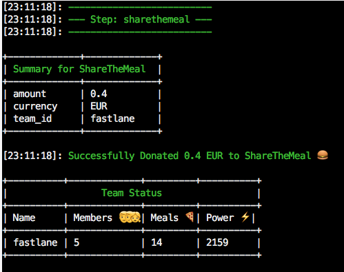
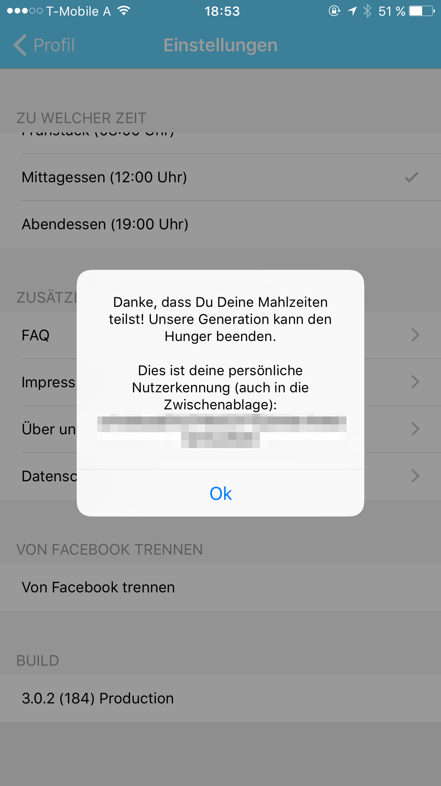

# ShareTheMeal Plugin for Fastlane

[](https://rubygems.org/gems/fastlane-plugin-sharethemeal)




## About

> Using this _fastlane_ plugin you can automatically donate food on [ShareTheMeal](https://sharethemeal.org) using _fastlane_.

[fastlane](https://fastlane.tools) saves us hours of work, which eventually saves us a lot of money. This is my way of reminding myself to give, on every deploy using [fastlane](https://fastlane.tools).


## ShareTheMeal

[ShareTheMeal](https://sharethemeal.org) is a crowdfunding application to fight global hunger launched by the United Nations World Food Programme (WFP) in 2015. It enables users to make small donations to specific WFP projects and to track its progress. As of August 2016, ShareTheMeal has over 600,000 downloads and 7 million meals shared.


## Setup

### Add Plugin
```
fastlane add_plugin sharethemeal
```

### Get your UserHash

To get started, you have to provide the payment information on your account

|  | Step |
|----------|:-------------|
| 💾 | Download the ShareTheMeal app ([Appstore](https://itunes.apple.com/us/app/sharethemeal/id977130010), [Google Play](https://play.google.com/store/apps/details?id=org.sharethemeal.app) |
| 🚀 | Open the app |
| 🍕 | Do a single donation manually to enter your credit card information |
| 📱 | Login and go to your profile |
| 🛠 | Open the setting screen |
| 👊 | Tap the version label at the bottom a few times |


| Setup | &nbsp; |
|---|---|
| **Step 1** | **Step 2** |
|  |  | 
| **Step 3** | **Step 4** |
|  |  |

After this you have your `userhash` in the clipboard.


## Example

```ruby
lane :donate do
  sharethemeal(
    amount: "0.4",
    userhash: "XXX",
    currency: "EUR"
  )
end

lane :deployment do
  gym         # Build your app
  deliver     # Submit your app
  donate      # Call the `donate` lane
end
```

You can also pass the userhash in your `SHARETHEMEAL_USERHASH` environment variable.

## Troubleshooting

If you have trouble using plugins, check out the [Plugins Troubleshooting](https://github.com/fastlane/fastlane/blob/master/fastlane/docs/PluginsTroubleshooting.md) doc in the main `fastlane` repo.

## About `fastlane`

`fastlane` is the easiest way to automate building and releasing your iOS and Android apps. Check out [fastlane.tools](https://fastlane.tools).
